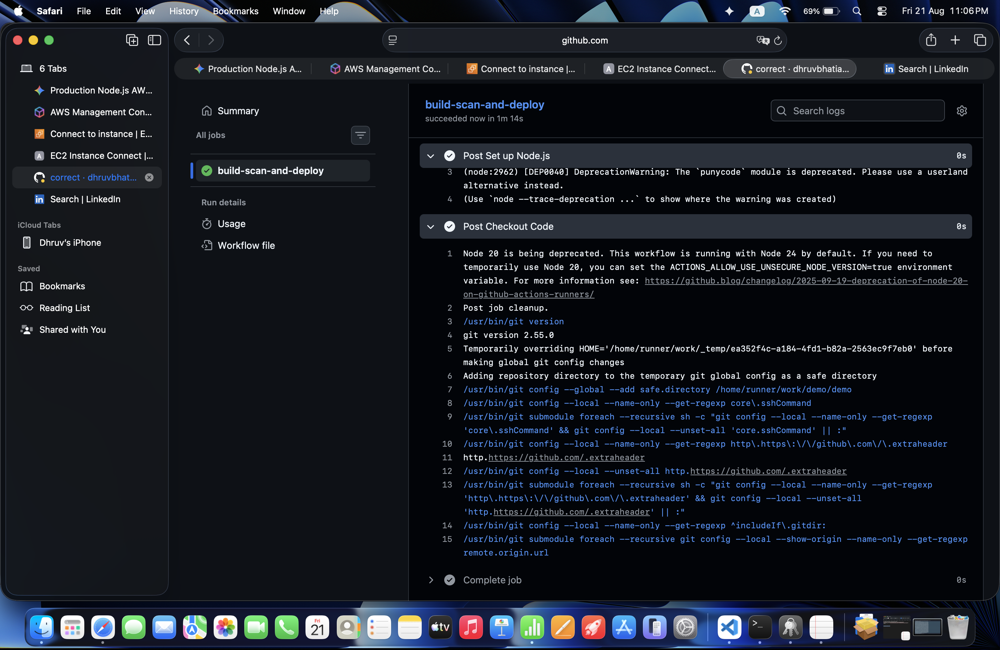
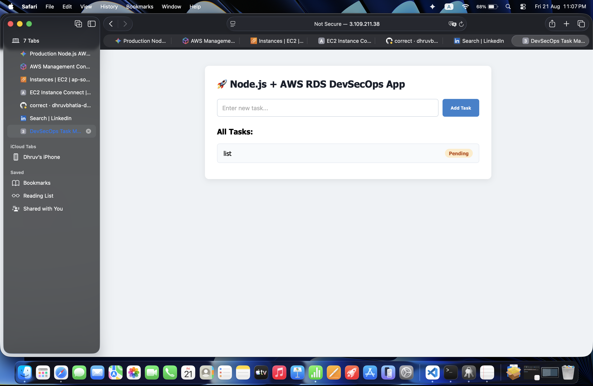

# DevSecOps Pipeline for Node.js App on AWS EC2 & RDS MySQL

This repository contains the infrastructure as code (IaC) and CI/CD pipelines to deploy a containerized Node.js and Express application to AWS EC2 with a managed RDS MySQL backend. It integrates security scanning via npm audit and Trivy to enforce DevSecOps practices before code is permitted to run in production.

## Key Features

*   **Infrastructure as Code (IaC):** Terraform provisioning of a custom VPC, subnets, Security Groups, an EC2 instance, and an RDS MySQL database.
*   **DevSecOps Scanning:** Automated vulnerability detection for application dependencies (`npm audit`) and container images (`Trivy`) integrated directly into the CI process.
*   **Automated Deployment:** GitHub Actions pipeline triggers on pushes to the main branch, automating Docker builds, ECR pushes, and remote SSH execution for zero-touch deployment.
*   **Database Security:** Isolated AWS RDS MySQL instance deployed in a private subnet, with security groups strictly limiting ingress to the EC2 application server.

## Repository Structure

```text
.
├── .github/
│   └── workflows/
│       └── deploy.yml
├── app/
│   ├── Dockerfile
│   ├── package.json
│   ├── server.js
│   └── tests/
├── terraform/
│   ├── main.tf
│   ├── variables.tf
│   ├── security.tf
│   └── outputs.tf
├── .gitignore
└── README.md
```

## Prerequisites

To provision the infrastructure and run the pipeline, you need the following installed and configured:

*   AWS CLI configured with appropriate IAM permissions (EC2, ECR, RDS, VPC, IAM).
*   Terraform CLI (v1.0.0 or later).
*   Docker and Docker Compose.
*   Node.js (v18+) and npm.
*   A GitHub repository with Actions enabled.

## Environment Variables

Create a `.env` file in the `/app` directory before running the application locally. Ensure this file is added to your `.gitignore`.

```env
PORT=3000
DB_HOST=your-rds-endpoint.amazonaws.com
DB_USER=db_admin
DB_PASSWORD=your_secure_password
DB_NAME=application_db
```

## Local Setup & Testing

Use the following commands to test the application logic and run baseline security checks on your local machine.

```bash
# Navigate to application directory
cd app

# Install dependencies
npm install

# Run local dependency security audit
npm audit

# Start the application locally
npm run start
```


## Terraform Infrastructure Provisioning

The infrastructure must be deployed before the CI/CD pipeline can run successfully, as the pipeline depends on the ECR repository and EC2 instance targets.

```bash
cd terraform

# Initialize the Terraform working directory
terraform init

# Generate and review the execution plan
terraform plan -out=tfplan

# Apply the planned infrastructure changes
terraform apply tfplan
```

To tear down the infrastructure and prevent further AWS billing:

```bash
terraform destroy
```

## Pipeline Workflow Steps & Required GitHub Secrets

The GitHub Actions pipeline defined in `.github/workflows/deploy.yml` executes the following sequence on every push to `main`:

1.  **Checkout Code:** Pulls the latest commit.
2.  **SCA Scan:** Runs `npm audit` to check for known vulnerabilities in Node dependencies.
3.  **Build Docker Image:** Compiles the Dockerfile into an image.
4.  **Container Scan:** Executes Trivy to scan the built Docker image for OS and library vulnerabilities.
5.  **Push to Registry:** Authenticates with AWS and pushes the validated image to AWS ECR.
6.  **Deploy to EC2:** Initiates an SSH connection to the EC2 instance, pulls the new image from ECR, and restarts the container runtime.

### Required GitHub Secrets

Configure the following secrets in your GitHub repository settings (Settings > Secrets and variables > Actions):

*   `AWS_ACCESS_KEY_ID`: IAM user access key with ECR push/pull permissions.
*   `AWS_SECRET_ACCESS_KEY`: IAM user secret key.
*   `AWS_REGION`: Target AWS region (e.g., `us-east-1`).
*   `ECR_REPOSITORY`: Name of the ECR repository created by Terraform.
*   `EC2_HOST`: Public IP address or DNS name of the deployed EC2 instance.
*   `EC2_USERNAME`: SSH user for the instance (e.g., `ubuntu` or `ec2-user`).
*   `EC2_SSH_KEY`: The private PEM key associated with the EC2 instance.

## Screenshots

### Architecture Diagram


### Pipeline Run (GitHub Actions)


### Live Application
